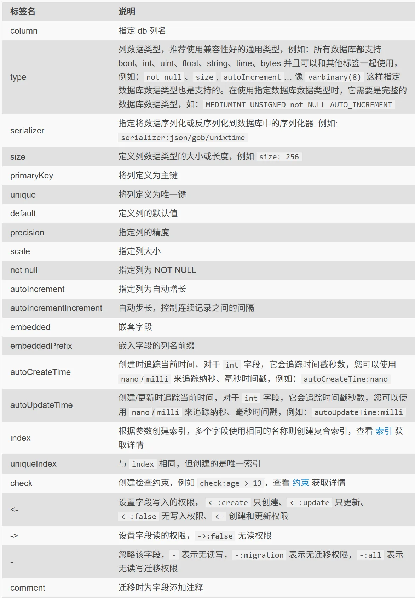
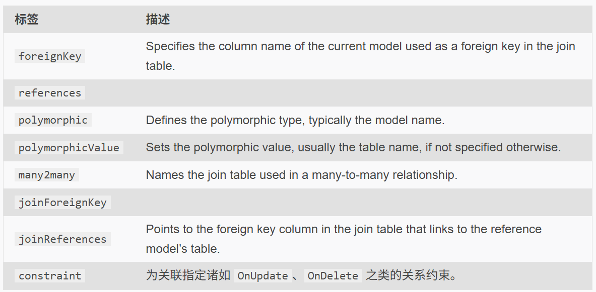

## GORM 模型定义
GORM 通过将 Go 结构体（Go structs） 映射到数据库表来简化数据库交互。 了解如何在GORM中定义模型，是充分利用GORM全部功能的基础。

### 1. 模型定义

#### 约定
1. **主键**：GORM 使用一个名为 `ID` 的字段作为每个模型的默认主键。 
2. **表名**：默认情况下，GORM 将结构体名称转换为 `snake_case` 并为表名加上复数形式。 For instance, a `User` struct becomes `users` in the database, and a `GormUserName` becomes `gorm_user_names`.
3. **列名**：GORM 自动将结构体字段名称转换为 `snake_case` 作为数据库中的列名。
4. **时间戳字段**：GORM使用字段 `CreatedAt` 和 `UpdatedAt` 来自动跟踪记录的创建和更新时间。

#### gorm.Model
GORM提供了一个预定义的结构体，名为 `gorm.Model`，其中包含常用字段：
- **ID** ：每个记录的唯一标识符（主键）。
- **CreatedAt** ：在创建记录时自动设置为当前时间。 
- **UpdatedAt**：每当记录更新时，自动更新为当前时间。 
- **DeletedAt**：用于软删除（将记录标记为已删除，而实际上并未从数据库中删除）。

```go
// gorm.Model 的定义
type Model struct {
    ID        uint           `gorm:"primaryKey"`
    CreatedAt time.Time
    UpdatedAt time.Time
    DeletedAt gorm.DeletedAt `gorm:"index"`
}
```
你可以将它嵌入到你自己的模型中：
```go
// 将 `ID`, `CreatedAt`, `UpdatedAt`, `DeletedAt`字段注入到`User`模型中
type User struct {
  gorm.Model
  Name string
}
```
当然你也可以完全自己定义模型：
```go
// 不使用gorm.Model，自行定义模型
type User struct {
  ID   int
  Name string
}
```

### 2. 字段标签
#### 结构体标签
在声明模型时，标签（Tags）是可选的，GORM 支持以下标签：**标签名称不区分大小写，但建议使用驼峰式命名（camelCase）。如果使用多个标签，它们之间应该用分号（;）分隔**。对于那些对解析器有特殊含义的字符，可以使用反斜杠（\）进行转义，以便将它们用作参数值


#### 关联标签

